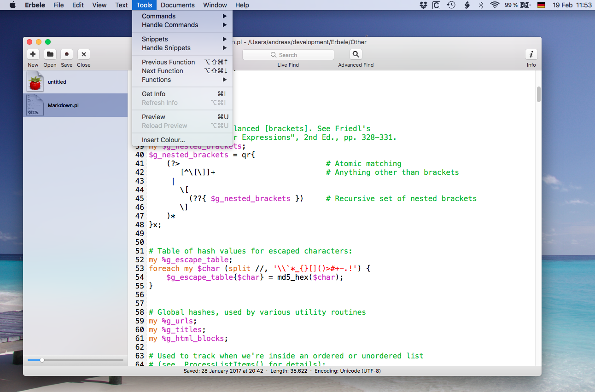
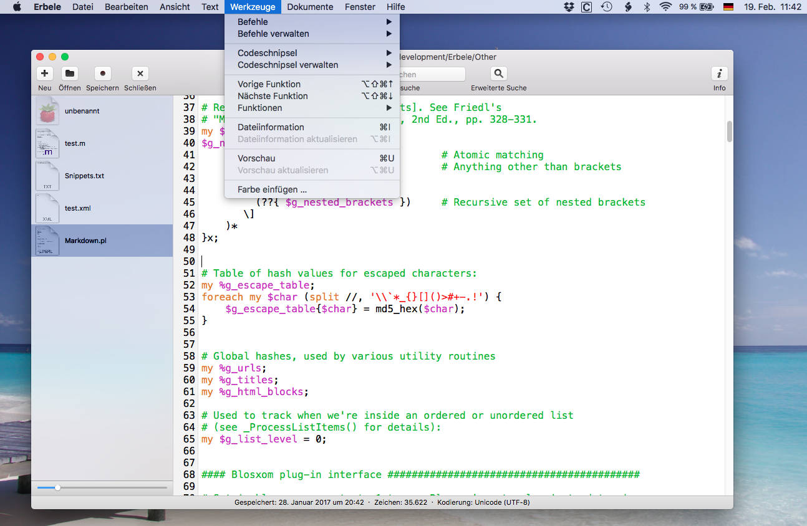

# Erbele

Erbele is a feature-rich text editor for macOS: powerful but easy to use, with syntax
highlighting for many languages, a project window for working on several documents at
once, and a large set of tools for editing text.

## Requirements

* macOS 11 (Big Sur) or later
* Xcode, to build it yourself
* Runs natively on both Intel and Apple Silicon

## Building

There are no external dependencies, no package manager and nothing to install:

```sh
git clone https://github.com/gerardp/erbele.git
cd erbele
xcodebuild -project Erbele.xcodeproj -scheme erbele -configuration Release build
```

Or open `Erbele.xcodeproj` in Xcode and press Run.

## Repository layout

| Directory | Contents |
| --- | --- |
| `Sources/` | Application code: `Classes/`, `TextView/`, `LineNumbers/` |
| `Vendor/` | Vendored third-party code: `PSMTabBar/`, `ICU/` |
| `Resources/` | Interface files, graphics, syntax definitions, translations |
| `Docs/` | Manual and screenshots |
| `Other/` | Core Data model, default commands and snippets, scripting definition |

The full manual is at [Docs/Erbele-Manual.pdf](Docs/Erbele-Manual.pdf).

## Screenshots



The same window in German:



## Roadmap

Fix bugs, improve what is already there and add the occasional feature, while keeping the
original focus and feature set:

* powerful, but easy to use
* many helpful tools for editing text
* support for many programming languages (syntax highlighting)

## Contributing

Bug reports and ideas are welcome in the [issues list](https://github.com/gerardp/erbele/issues).

English is the official language of this repository: code, comments, commit messages and
issues are all written in English. See [AGENTS.md](AGENTS.md) for the project conventions.

## Privacy

Read the [Privacy Statement](./Privacy.md).

## License

Apache License 2.0. See [LICENSE-2.0.txt](./LICENSE-2.0.txt).

---

## Fork

This is a fork of [Erbele](https://github.com/abentele/Erbele) by Andreas Bentele, which
is no longer maintained.

Erbele itself was forked in 2016 from [Fraise 3.7.3](https://github.com/jfmoy/Fraise),
which had in turn been forked from [Smultron 3.5.1](https://sourceforge.net/projects/smultron/),
maintained by Peter Borg.
